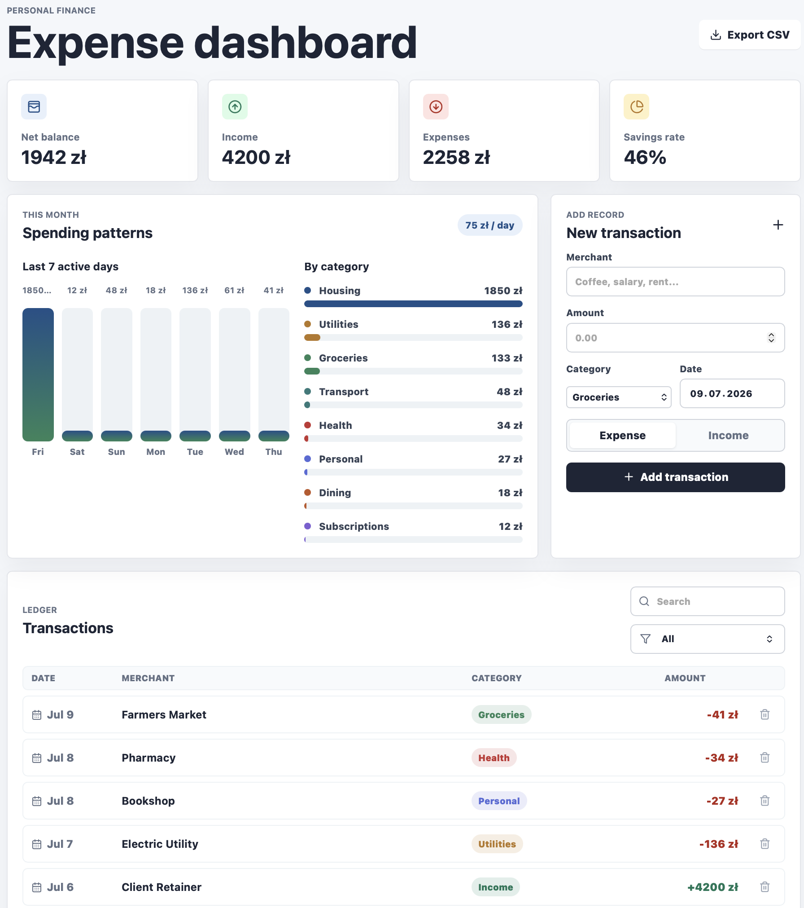

# Personal Finance Dashboard

A responsive React dashboard for tracking personal income, expenses, category spending, and recent transaction activity.



## Features

- Monthly summary cards for net balance, income, expenses, and savings rate
- Spending pattern charts for recent active days and expense categories
- Transaction form for adding income and expense records
- Search and category filtering for the ledger
- CSV export for the current transaction list
- Currency formatting in Polish zloty (PLN)

## Tech Stack

- React 18
- Vite
- Lucide React icons
- Plain CSS

## Getting Started

Install dependencies:

```bash
npm install
```

Start the local development server:

```bash
npm run dev
```

Build for production:

```bash
npm run build
```

Preview the production build:

```bash
npm run preview
```

## Project Structure

```text
.
├── index.html
├── package.json
├── package-lock.json
└── src
    ├── main.jsx
    └── styles.css
```

## Notes

The dashboard currently uses in-memory sample transactions. Any transactions added in the browser are reset when the page reloads.
